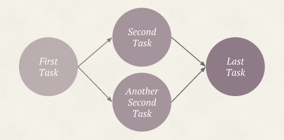
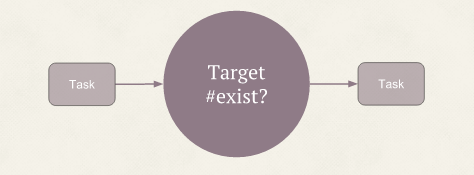
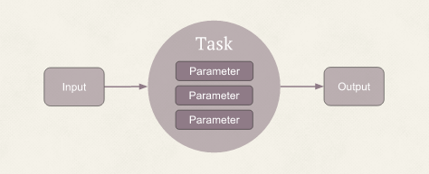

## Overview

Tumugi is inspired by [Luigi](https://github.com/spotify/luigi) written by Python, and our goal is create a better alternative of Rake. It can describe and run workflow written by ruby code.

<iframe src="https://docs.google.com/presentation/d/1KnUcKZgLNKXoi-4UFMNQHGup8Tb4_3XBhO4Ov_ZXMOY/embed?start=false&loop=false&delayms=5000&slide=1" frameborder="0" width="100%" height="389" allowfullscreen="true" mozallowfullscreen="true" webkitallowfullscreen="true"></iframe><br>

### Dependency resolution and parallel execution

Tumugi can resolve dependencies of tasks in a workflow and automatically run task in parallel if dependency task is already completed.



If `First Task` is completed, `Second Task` and `Another Second Task` run in parallel. `Last Task` wait until `Second Task` and `Another Second Task` completed.

### Building a workflow as code

Using tumugi, workflow file is just a ruby code like below. So you can use any editors and rubygems as you like. Workflow as code is also good for version control, code review.

```rb
task :last_task do
  requires [:second_task, :another_second_task]
end

task :second_task do
  requires :first_task
end

task :another_second_task do
  requires :first_task
end

task :first_task do
end
```

### Target and Parameters



`Target` is input and onput of `Task`, and is a ruby class which has at least `exist?` method.



`Parameter` is another input of `Task`. `Task#run` method can refer these parameters and user can set parameter value from CLI options.

### Plugin based architecture

Tumugi is based on plugin architecutre. All `Task` and `Targets` are made by plugin. Currently you can create custom `Task` and `Target` by plugin or reuse existing [plugins](plugins).
