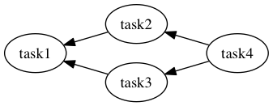

## Prerequisities

- Ruby >= 2.1
- Bundler

## Installation

Create `Gemfile` and write following contents:

```ruby
source 'https://rubygems.org'

gem 'tumugi', '~> 0.6.1'
```

And then execute:

```bash
$ bundle install
```

## Define workflow by tumugi DSL



You can define workflow above as ruby code:

```rb
task :task1 do
  requires [:task2, :task3]
  run { puts 'task1#run' }
end

task :task2 do
  requires :task4
  run { puts 'task2#run' }
end

task :task3 do
  requires :task4
  run { puts 'task3#run' }
end

task :task4 do
  run {
    puts 'task4#run'
    sleep 3
  }
end
```

Save these code into `workflow.rb`,
then run this script by `tumugi` command like this:

```bash
$ bundle exec tumugi run -f workflow.rb task1
2016-07-11 15:04:57 +0900 INFO [bc53bb58-03c4-467e-9cec-f658729b3d99] Load workflow from getting_started.rb
2016-07-11 15:04:57 +0900 INFO [bc53bb58-03c4-467e-9cec-f658729b3d99] start workflow: bc53bb58-03c4-467e-9cec-f658729b3d99
2016-07-11 15:04:57 +0900 INFO [bc53bb58-03c4-467e-9cec-f658729b3d99] start: task4, thread: 70254131630100
task4#run
2016-07-11 15:05:00 +0900 INFO [bc53bb58-03c4-467e-9cec-f658729b3d99] completed: task4, thread: 70254131630100
2016-07-11 15:05:00 +0900 INFO [bc53bb58-03c4-467e-9cec-f658729b3d99] start: task2, thread: 70254131630100
task2#run
2016-07-11 15:05:00 +0900 INFO [bc53bb58-03c4-467e-9cec-f658729b3d99] completed: task2, thread: 70254131630100
2016-07-11 15:05:00 +0900 INFO [bc53bb58-03c4-467e-9cec-f658729b3d99] start: task3, thread: 70254131630100
task3#run
2016-07-11 15:05:00 +0900 INFO [bc53bb58-03c4-467e-9cec-f658729b3d99] completed: task3, thread: 70254131630100
2016-07-11 15:05:00 +0900 INFO [bc53bb58-03c4-467e-9cec-f658729b3d99] start: task1, thread: 70254131630100
task1#run
2016-07-11 15:05:00 +0900 INFO [bc53bb58-03c4-467e-9cec-f658729b3d99] completed: task1, thread: 70254131630100
2016-07-11 15:05:00 +0900 INFO [bc53bb58-03c4-467e-9cec-f658729b3d99] end workflow: bc53bb58-03c4-467e-9cec-f658729b3d99
2016-07-11 15:05:00 +0900 INFO [bc53bb58-03c4-467e-9cec-f658729b3d99] Result report:
+-------+----------+------------+-----------+
|              Workflow Result              |
+-------+----------+------------+-----------+
| Task  | Requires | Parameters | State     |
+-------+----------+------------+-----------+
| task4 |          |            | completed |
+-------+----------+------------+-----------+
| task2 | task4    |            | completed |
+-------+----------+------------+-----------+
| task3 | task4    |            | completed |
+-------+----------+------------+-----------+
| task1 | task2    |            | completed |
|       | task3    |            |           |
+-------+----------+------------+-----------+
2016-07-11 15:05:00 +0900 INFO [bc53bb58-03c4-467e-9cec-f658729b3d99] status: success, command: run, task: task1, options: {"config"=>"tumugi_config.rb", "quiet"=>false, "verbose"=>false, "log_format"=>"text", "file"=>"getting_started.rb"}
```
