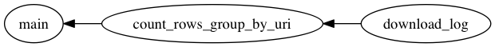

## Recipe1: Download file and save it as local file

This guide explain about how to write a workflow doing following tasks by tumugi.

1. Download archived daily access logs from remote servers using `wget` command
2. Count number of rows group by URI and save result into CSV file

This guide assumes you are using Unix like OS, such as Ubuntu, CentOS, or Mac OS X.

## Prerequisities

- Ruby >= 2.1
- Bundler
- graphviz

## Installation

Create `Gemfile` and write following contents:

```ruby
source 'https://rubygems.org'

gem 'tumugi', '~> 0.6.3'
gem 'tumugi-plugin-command', '~> 0.3.0'

gem 'ltsv'
gem 'rubyzip'
```

And then execute:

```sh
$ bundle install
```

## Define workflow by tumugi DSL

You can define workflow above using tumugi DSL.

```rb
require 'ltsv'
require 'zip'

####################################################
# 1. Archived log download
####################################################

task :download_log, type: :command do
  param :host, default: 'https://tumugi.github.io'
  param :log_filename, type: :string
  param :day, auto_bind: true, type: :time, required: true # <= This value is auto binding from CLI parameter

  log_filename {
    "access_#{day.strftime('%Y%m%d')}.log.zip"
  }
  command {
    url = "#{host}/data/#{log_filename}"
    "wget #{url} -O #{output.path}"
  }

  output {
    target(:local_file, "tmp/#{log_filename}")
  }
end

####################################################
# 2. Count rows group by URI
####################################################

task :count_rows_group_by_uri do
  requires :download_log
  output target(:local_file, '/tmp/result.csv')
  run {
    counts = {}
    Zip::File.open(input.path) do |zip_file|
      zip_file.each do |entry|
        entry.get_input_stream.each do |line|
          values = LTSV.parse(line).first
          counts[values[:uri]] ||= 0
          counts[values[:uri]] += 1
        end
      end
    end
    output.open('w') do |o|
      counts.each do |k, v|
        o.puts "#{k},#{v}"
      end
    end
  }
end

####################################################
# Root Task
####################################################

task :main do
  requires :count_rows_group_by_uri
  run {
    log File.read(input.path)
  }
end
```

Save this code as `recipe1.rb`, then check this workflow.
Tumugi provides DAG (Directed Acyclic Graph) of workflow visualize feature.
`show` command can visualize DAG (Directed Acyclic Graph) of workflow like:

```sh
$ bundle exec tumugi show -f recipe1.rb -p day:2016-05-02 -o recipe1.png main
```



Check visualized workflow and it's OK, you can run it.

```sh
$ mkdir tmp
$ bundle exec tumugi run -f recipe1.rb -p day:2016-05-02 main
```

Then you can get result like this:

```sh
2016-07-11 15:28:39 +0900 INFO [45f23a9a-eb61-4516-ac9c-512bfc21dea7] Parameters: {"day"=>"2016-05-02"}
2016-07-11 15:28:39 +0900 INFO [45f23a9a-eb61-4516-ac9c-512bfc21dea7] Load workflow from recipe1.rb
2016-07-11 15:28:39 +0900 INFO [45f23a9a-eb61-4516-ac9c-512bfc21dea7] start workflow: 45f23a9a-eb61-4516-ac9c-512bfc21dea7
2016-07-11 15:28:39 +0900 INFO [45f23a9a-eb61-4516-ac9c-512bfc21dea7] skipped: download_log is already completed, thread: 70195091864060
2016-07-11 15:28:39 +0900 INFO [45f23a9a-eb61-4516-ac9c-512bfc21dea7] skipped: count_rows_group_by_uri is already completed, thread: 70195091864060
2016-07-11 15:28:39 +0900 INFO [45f23a9a-eb61-4516-ac9c-512bfc21dea7] start: main, thread: 70195092510140
2016-07-11 15:28:39 +0900 INFO [45f23a9a-eb61-4516-ac9c-512bfc21dea7] /api/v1/messages,7150
/api/v1/textdata,7373
/api/v1/people,7377

2016-07-11 15:28:39 +0900 INFO [45f23a9a-eb61-4516-ac9c-512bfc21dea7] completed: main, thread: 70195092510140
2016-07-11 15:28:39 +0900 INFO [45f23a9a-eb61-4516-ac9c-512bfc21dea7] end workflow: 45f23a9a-eb61-4516-ac9c-512bfc21dea7
2016-07-11 15:28:39 +0900 INFO [45f23a9a-eb61-4516-ac9c-512bfc21dea7] Result report:
+-------------------------+-------------------------+--------------------------------------+-----------+
|                                           Workflow Result                                            |
+-------------------------+-------------------------+--------------------------------------+-----------+
| Task                    | Requires                | Parameters                           | State     |
+-------------------------+-------------------------+--------------------------------------+-----------+
| download_log            |                         | host=https://tumugi.github.io        | skipped   |
|                         |                         | log_filename=access_20160502.log.zip |           |
|                         |                         | day=2016-05-02 00:00:00 +0900        |           |
|                         |                         | command=wget https://tumugi.githu... |           |
|                         |                         | output_file=                         |           |
|                         |                         | env={}                               |           |
+-------------------------+-------------------------+--------------------------------------+-----------+
| count_rows_group_by_uri | download_log            |                                      | skipped   |
+-------------------------+-------------------------+--------------------------------------+-----------+
| main                    | count_rows_group_by_uri |                                      | completed |
+-------------------------+-------------------------+--------------------------------------+-----------+
2016-07-11 15:28:39 +0900 INFO [45f23a9a-eb61-4516-ac9c-512bfc21dea7] status: success, command: run, task: main, options: {"config"=>"tumugi_config.rb", "quiet"=>false, "verbose"=>false, "log_format"=>"text", "file"=>"recipe1.rb", "params"=>{"day"=>"2016-05-02"}}
```
