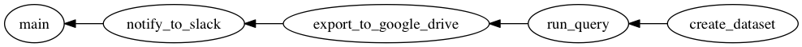
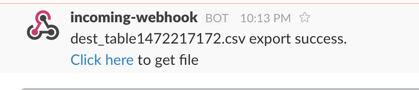

## Recipe2: Export BigQuery query result to Google Drive and notify URL to Slack

This guide explain about how to export BigQuery query result into Google Drive file and notify URL to slack by tumugi.

1. Execute query on BigQuery and save result to table
2. Export table to Google Drive
3. Notify Google Drive URL to Slack

This guide assumes you are using Unix like OS, such as Ubuntu, CentOS, or Mac OS X.

## Prerequisities

- Ruby >= 2.3
- Bundler
- graphviz

## Installation

Create `Gemfile` and write following contents:

```ruby
source 'https://rubygems.org'

gem 'tumugi', '~> 0.6.3'
gem "tumugi-plugin-bigquery", "~> 0.3.0"
gem "tumugi-plugin-google_drive", "~> 0.4.0"
gem "tumugi-plugin-webhook", "~> 0.1.1"
```

And then execute:

```sh
$ bundle install
```

## Setup Google Cloud Platform API

Before run this guide's workflow, you have to setup Google Cloud Platform API settings.

### Create service accounts

You need a service account to call Google API. Service account is an account that belongs to your application instead of to an individual end user.

How to create a service account see [official guide](https://developers.google.com/identity/protocols/OAuth2ServiceAccount#creatinganaccount)

Create service accounts who has and download

For more detail, see https://cloud.google.com/storage/docs/authentication

### Enable Google Drive API

As default, Google Driver API is disabled on your GCP project.
So you have to enable it.

How to enable Google Drive API, see [Step 1: Turn on the Drive API in official guide](https://developers.google.com/drive/v3/web/quickstart/ruby#step_1_turn_on_the_api_name)

## Setup Slack incomming webhook

Create incomming webhook integration on you Slack team.
And get webhook URL like `https://hooks.slack.com/services/xxx`.
Use it later in workflow definition file.

## Create tumugi config file

tumugi config file is a file to write ommon settings for plugins such as API key, private key file path and so on.

You can specify config file path by command line option `-c`.
If you are not set `-c` option and current directory include file named `tumugi_config.rb`, tumugi automatically load the file.

Here is a tumugi config file for this guide. Save this as a file named `tumugi_config.rb`.

```rb
Tumugi.configure do |config|
  private_key_file = ENV['GCP_PRIVATE_KEY_FILE']

  config.section("bigquery") do |section|
    section.private_key_file = private_key_file
  end

  config.section("google_drive") do |section|
    section.private_key_file = private_key_file
  end
end
```

## Define workflow by tumugi DSL

You can define workflow above using tumugi DSL.

```rb
####################################################
# Recipe2: Export BigQuery query result to
#          Google Drive and notify URL to Slack
#
# https://tumugi.github.io/recipe2/
#
# 1. Execute query on BigQuery and save result to table
# 2. Export table to Google Drive
# 3. Notify Google Drive URL to Slack
####################################################

####################################################
# 1. Execute query on BigQuery and save result to table
####################################################

task :create_dataset, type: :bigquery_dataset do
  dataset_id "tmp"
end

task :run_query, type: :bigquery_query do
  requires :create_dataset

  dataset_id { input.dataset_id }
  table_id   "dest_table#{Time.now.to_i}"
  query <<~SQL
    SELECT
      word,
      word_count
    FROM
      publicdata:samples.shakespeare
    WHERE
      corpus = "hamlet"
    ORDER BY
      word_count DESC
    LIMIT
      100
  SQL
end

####################################################
# 2. Export table to Google Drive
####################################################

task :export_to_google_drive, type: :bigquery_export do
  requires :run_query

  dataset_id { input.dataset_id }
  table_id   { input.table_id }

  output { target(:google_drive_file, name: "#{input.table_id}.csv", parents: ENV['GOOGLE_DRIVE_FOLDER_ID']) }
end

####################################################
# 3. Notify Google Drive URL to Slack
####################################################

task :notify_to_slack, type: :webhook do
  requires :export_to_google_drive

  url ENV['SLACK_WEBHOOK_URL']
  body { { text: "#{input.name} export success.\n<#{input.url}|Click here> to get file" } }
end

####################################################
# Main Task
####################################################

task :main do
  requires :notify_to_slack
  run { log "Finished" }
end
```

Save this code as `recipe2.rb`, then check this workflow.
Tumugi provides DAG (Directed Acyclic Graph) of workflow visualize feature.
`show` command can visualize DAG (Directed Acyclic Graph) of workflow like:

```sh
$ bundle exec tumugi show -f recipe2.rb -o recipe2.png main
```



Check visualized workflow and it's OK, you can run it.

```sh
$ export GCP_PRIVATE_KEY_FILE="/path/to/gcp/private/key.json"
$ export GOOGLE_DRIVE_FOLDER_ID="folder_id"
$ export SLACK_WEBHOOK_URL="https://hooks.slack.com/services/xxx"
$ bundle exec tumugi run -f recipe2.rb main
```

If workflow runs successfully, you got slack notification like this:


